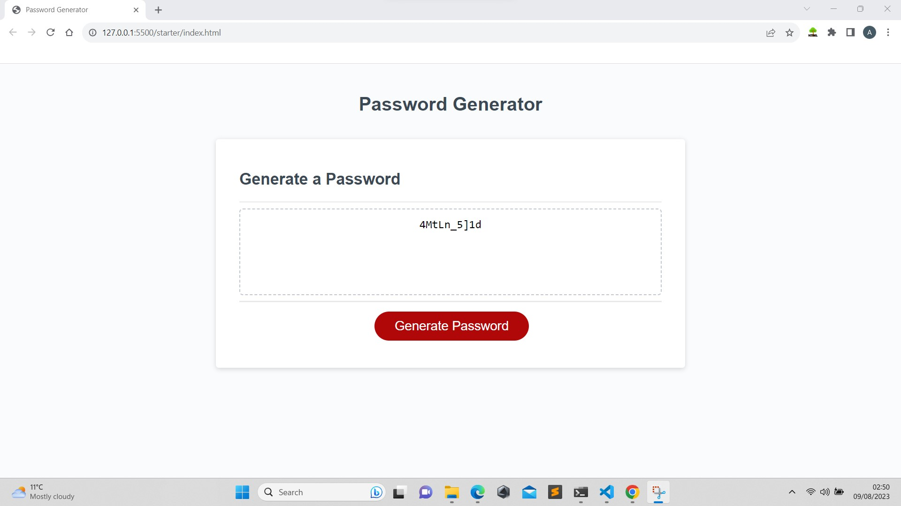

# Password-Generator-App

## Instructions:

The challenge is to Generate a password when the button is clicked

- Present a series of prompts for password criteria
  - Length of password
    - At least 8 characters but no more than 128.
  - Character types
    - Lowercase
    - Uppercase
    - Numeric
    - Special characters ($@%&\*, etc)
- Code should validate for each input and at least one character type should be selected
- Once prompts are answered then the password should be generated and displayed in an alert or written to the page.

I have however chosen to display the password to the page.

## Tools and Resources:

    ** VsCose
    ** Google (bing) Search
    ** Git/GitHub

## URLs:

my github repo
https://github.com/ollyvent/Password-Generator-App.git

my deployed site
https://ollyvent.github.io/Password-Generator-App/

## video Result
<video src="./assets/password-gen.mp4" width=auto></video>
## image result

